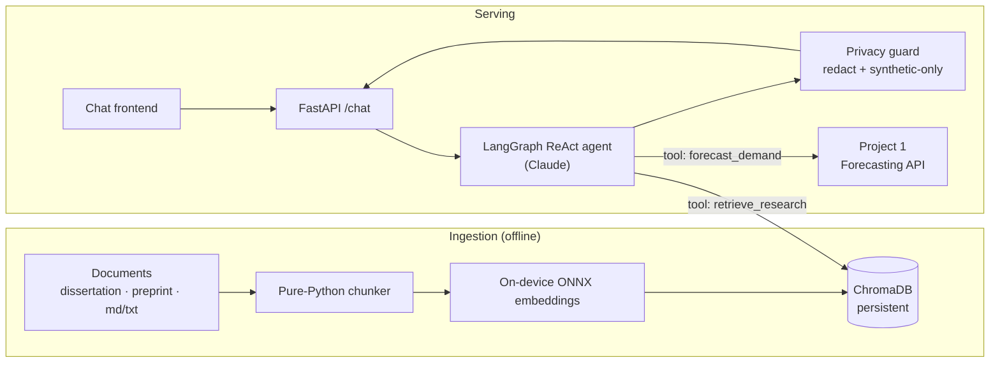

# Privacy-Preserving RAG Agent — Research Q&A with Live Tool-Calling

[](https://github.com/minhazda/privacy-preserving-rag-agent/actions/workflows/ci.yml)


A production-grade **retrieval-augmented agent** that answers questions about my
research on retail demand forecasting and can **call a live forecasting model**
as a tool — all behind a privacy guard that guarantees only **synthetic** data
is ever exposed. This is Project 2 of a portfolio; it consumes the forecasting
API from [Project 1](https://github.com/minhazda/synthetic-retail-mlops-pipeline).

Same engineering bar as Project 1: typed, tested, type-checked, containerized,
and shipped through CI/CD.

> **Author:** Md Minhazur Rahman · MSc Data Science, University of Greenwich

---

## What it does

- **RAG over my research.** Ingests the dissertation + preprint into a local
  ChromaDB vector store and answers grounded, cited questions.
- **Tool-calling agent (LangGraph).** A ReAct agent autonomously chooses between
  retrieving research passages and running a **live demand forecast**.
- **Privacy by design.** Embeddings run **on-device** (ONNX MiniLM — nothing
  leaves the machine). A guard redacts PII and enforces a synthetic-only
  allow-list on every record and every final answer (fail-closed).
- **FastAPI backend + chat frontend.** A `/chat` endpoint and a minimal web UI.

---

## Architecture



Every tool result and the final answer pass through the **privacy guard** before
reaching the user. `forecast_demand` validates each feature row against the
synthetic allow-list *before* it leaves the process, so the tool can never be
used to send or surface real data.

---

## Project structure

```
02-privacy-preserving-rag-agent/
├── src/rag_agent/
│   ├── config.py          # Typed, YAML-driven config (secrets from env)
│   ├── exceptions.py      # Custom exception hierarchy
│   ├── logging_config.py  # Structured JSON logging
│   ├── privacy.py         # PII redaction + synthetic-only guard (pure-Python)
│   ├── ingest.py          # Loader + pure-Python chunker
│   ├── vectorstore.py     # ChromaDB + on-device ONNX embeddings
│   ├── tools.py           # retrieve_research, forecast_demand (testable)
│   ├── agent.py           # LangGraph ReAct agent
│   ├── eval/              # Two-tier eval: lexical proxies + LLM-as-judge
│   └── api/main.py        # FastAPI + chat frontend
├── tests/                 # privacy, config, ingest, tools, api, eval (mocked)
├── configs/config.yaml    # Central configuration
├── data/documents/        # Corpus (your PDFs go here; gitignored)
├── Dockerfile · docker-compose.yml · docker/entrypoint.sh
├── .github/workflows/ci.yml
├── requirements.txt · requirements-dev.txt · requirements-ci.txt · requirements-eval.txt
└── pyproject.toml
```

---

## Quickstart

### 1. Configure your key
The agent uses Claude. The key is read **only** from the environment:

```bash
export ANTHROPIC_API_KEY=sk-ant-...
```

Add your `dissertation.pdf` and `preprint.pdf` to `data/documents/` (a synthetic
sample doc is included so everything works without them).

### Option A — Docker Compose

```bash
docker compose run --rm ingest      # index the corpus
docker compose up api               # http://localhost:8080
```

### Option B — Local Python

```bash
python -m venv .venv && source .venv/bin/activate
pip install -r requirements-dev.txt && pip install -e .

python -m rag_agent.ingest                                  # build the index
uvicorn rag_agent.api.main:app --port 8080                  # serve UI + API
```

Ask a question:

```bash
curl -s -X POST http://localhost:8080/chat \
  -H 'Content-Type: application/json' \
  -d '{"message": "What MAE reduction did the model achieve, and forecast demand for a promo hour?"}'
```

To enable the `forecast_demand` tool, run Project 1's API and point
`forecasting.api_url` in `configs/config.yaml` at it (default
`http://localhost:8000`).

---

## Privacy design

| Layer | Guarantee |
|-------|-----------|
| **Embeddings** | On-device ONNX model — no document text is sent to any API. |
| **Tool inputs** | Every forecast row checked against a synthetic-only allow-list; forbidden/identifying keys are rejected (fail-closed). |
| **Outputs** | PII patterns (email, phone, SSN, IPv4, Luhn-valid cards) are redacted; responses are length-capped. |
| **Secrets** | `ANTHROPIC_API_KEY` is read from the environment only — never from config or code. |

Because the underlying data is synthetic by construction, the guard should never
have anything to redact in normal use — it is defence in depth.

---

## Quality gates

| Tool | Purpose |
|------|---------|
| **ruff / black** | Lint, import order, formatting |
| **mypy** | Static typing (all functions typed) |
| **pytest** | Unit tests for privacy, config, chunking, tools, API, and eval |
| **pre-commit** | Runs the above on every commit |

Unit tests mock the LLM, vector store, and forecasting API, so they run in
milliseconds with **no API key and no heavy dependencies**. CI runs them on a
light profile (`requirements-ci.txt`); the Docker build job validates the full
pinned stack installs cleanly.

```bash
ruff check src tests && black --check src tests && mypy src && pytest
```

---

## CI/CD

`.github/workflows/ci.yml` runs three jobs on every push/PR:
1. **quality** — ruff, black, mypy, pytest (mocked, fast).
2. **docker** — build the multi-stage image; on `main`, push to GHCR.
3. **smoke** — the built image imports the app and loads config in a clean
   container.

---

## 📊 Evaluation

Two complementary scorers, both driven from `python -m rag_agent.eval`:

### Tier 1 — Lexical proxies (CI gate, no API key)
Deterministic RAGAS-style proxies in `src/rag_agent/eval/metrics.py`: tokens are
lowercased, stop-words removed and light-stemmed, then overlap is scored between
answer sentences, question terms, and retrieved contexts. They run in
milliseconds with no network, so CI can gate on them deterministically.

### Tier 2 — LLM-as-judge (Claude, opt-in)
`python -m rag_agent.eval --judge` grades each case with a Claude model
(`src/rag_agent/eval/llm_judge.py`) on a 1–5 rubric for **faithfulness**,
**answer relevance**, and **context precision** (normalised to 0–1). Needs
`ANTHROPIC_API_KEY`; the judge model is configurable via `RAG_JUDGE_MODEL`
(default `claude-sonnet-4-6`). Set Langfuse keys to **trace every judgement**.
This is the meaningful generative grade; the lexical tier is the fast,
deterministic guardrail.

```bash
# Tier 1 — lexical (what CI runs)
pip install -e .
python -m rag_agent.eval

# Tier 2 — LLM-as-judge (+ optional Langfuse tracing)
pip install -r requirements-eval.txt
export ANTHROPIC_API_KEY=sk-ant-...
python -m rag_agent.eval --judge
```

**Dataset:** 10 hand-written gold cases in `src/rag_agent/eval/dataset.py`,
grounded in the research domain (synthetic data, demand forecasting, differential
privacy, CTGAN, MASE, leakage prevention, the privacy guard, on-device
embeddings, rolling-origin CV, MAPE pitfalls). Lexical means clear the CI
thresholds (faithfulness ≥ 0.70, answer relevance ≥ 0.60, context precision
≥ 0.50); the gold answers are written to be faithful, so the lexical tier proves
the gate works while `--judge` stress-tests real agent outputs.

---

## Roadmap

- Streaming responses (SSE) in the chat UI.
- Hybrid retrieval (BM25 + dense) and reranking.
- Terraform for cloud deployment (shared with Project 1).

---

## License

MIT © Md Minhazur Rahman
