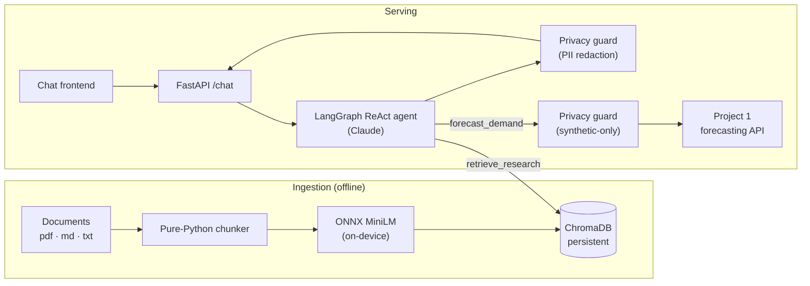

# Privacy-Preserving RAG Agent

[](https://github.com/minhazda/privacy-preserving-rag-agent/actions/workflows/ci.yml)


A production-grade **RAG agent** that answers questions about retail-forecasting
research and can run **live demand forecasts** through tool-calling — while a
privacy guard guarantees that **only synthetic, non-identifying data is ever
exposed**. It pairs with [Project 1](https://github.com/minhazda/synthetic-retail-mlops-pipeline)
(the forecasting pipeline), calling its API as a tool.

> **Author:** Md Minhazur Rahman · MSc Data Science, University of Greenwich

---

## What it does

- **Retrieval-augmented Q&A** over a corpus (dissertation + preprint) indexed in
  **ChromaDB** with **on-device ONNX embeddings** — no API key, no network for
  embeddings, nothing leaves the machine.
- **A LangGraph ReAct agent** (Claude) that autonomously chooses between two
  tools: `retrieve_research` and `forecast_demand`.
- **Tool-calling for live forecasts**: `forecast_demand` calls the Project 1
  inference API — but every row is validated against a synthetic-feature
  allow-list first, so the tool cannot send or surface real data.
- **A privacy guard** that redacts PII-shaped strings (emails, phones, SSNs,
  cards via Luhn, IPs) and fail-closes on any non-allow-listed record.
- **FastAPI backend + a minimal chat frontend**, containerized, tested, and
  shipped through CI/CD.

---

## Architecture



Every tool result and final answer passes through the privacy guard before it
reaches the user. Because the underlying data is synthetic by construction, the
guard normally has nothing to redact — it is **defence in depth**, not a crutch.

---

## Project structure

```
02-privacy-preserving-rag-agent/
├── src/rag_agent/
│   ├── config.py          # Typed, YAML-driven config (secrets from env only)
│   ├── exceptions.py      # Custom exception hierarchy
│   ├── logging_config.py  # Structured JSON logging
│   ├── privacy.py         # PII redaction + synthetic-only guard (pure-Python)
│   ├── vectorstore.py     # ChromaDB + on-device ONNX embeddings (lazy import)
│   ├── ingest.py          # Loader + pure-Python chunker + indexer
│   ├── tools.py           # retrieve_research · forecast_demand (testable)
│   ├── agent.py           # LangGraph ReAct agent wiring
│   └── api/main.py        # FastAPI app + chat frontend
├── tests/                 # pytest: privacy, config, ingest, tools, api (mocked)
├── configs/config.yaml    # Central configuration
├── data/documents/        # Corpus (your PDFs go here; gitignored)
├── Dockerfile · docker-compose.yml · docker/entrypoint.sh
├── .github/workflows/ci.yml
├── requirements.txt · requirements-ci.txt · requirements-dev.txt
└── pyproject.toml
```

---

## Quickstart

### 1. Configure secrets
The agent uses Claude; the key is read **only** from the environment.
```bash
export ANTHROPIC_API_KEY=sk-ant-...
```

### 2. Add your corpus
Drop `dissertation.pdf` and `preprint.pdf` into `data/documents/` (gitignored).
A synthetic sample doc ships so everything works out of the box.

### 3. Docker (recommended)
```bash
docker compose run --rm ingest   # index the corpus into ChromaDB
docker compose up api            # serve on http://localhost:8080
```

### 4. Local Python
```bash
python -m venv .venv && source .venv/bin/activate
pip install -r requirements-dev.txt && pip install -e .

python -m rag_agent.ingest                         # index corpus
uvicorn rag_agent.api.main:app --port 8080         # serve
```

```bash
curl -s localhost:8080/health
curl -s -X POST localhost:8080/chat \
  -H 'Content-Type: application/json' \
  -d '{"message": "What MAE reduction did the model achieve?"}'
```

To enable live forecasts, run the Project 1 API and point
`forecasting.api_url` in `configs/config.yaml` at it.

---

## Privacy model

| Layer | Guarantee |
|-------|-----------|
| **Data** | All data is synthetic — generated, never sourced from real customers. |
| **Input guard** | `forecast_demand` rejects any row with a non-allow-listed or identifying field **before** it leaves the process (fail-closed). |
| **Output guard** | Every answer is scanned and PII-shaped strings (email, phone, SSN, Luhn-valid cards, IPv4) are redacted. |
| **Secrets** | API keys come from the environment only — never config or code. |

The guard is pure-Python and exhaustively unit-tested (`tests/test_privacy.py`).

---

## Quality gates

```bash
ruff check src tests && black --check src tests && mypy src && pytest
```

CI runs three jobs: **quality** (lint, type-check, mocked unit tests on a light
profile), **docker** (build + push to GHCR — validates the full runtime stack
install), and **smoke** (the built image imports and loads config). Heavy
dependencies (ChromaDB, LangChain) are imported lazily and mocked in tests, so
unit CI is fast and needs no API key.

---

## Roadmap

- Streaming responses (SSE) in the chat UI.
- Reranking + hybrid (BM25 + vector) retrieval.
- Per-tenant collections and answer-level citation highlighting.
- Evidently-based monitoring of retrieval quality and answer drift.

---

## License

MIT © Md Minhazur Rahman
