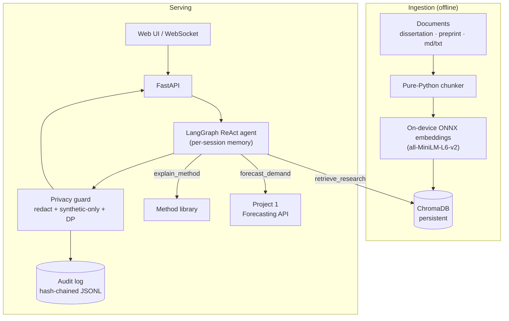

# Architecture

Privacy-preserving RAG agent that answers questions about retail demand
forecasting research and calls a live forecasting model as a tool — over
synthetic data only.

## System diagram

## Request lifecycle

1. Client sends a message over `POST /chat` or the `/ws/chat` WebSocket, with an
   optional `session_id`.
2. The agent plans with a ReAct loop, choosing among three tools.
   `retrieve_research` rewrites the query, retrieves from ChromaDB, and applies a
   confidence gate (low top-1 relevance → an honest "I don't know").
3. Every tool result and the final answer pass through the **privacy guard**
   (PII redaction + synthetic-only allow-list, fail-closed). Forecast values can
   additionally be perturbed with an ε-DP Laplace mechanism.
4. The turn is recorded to the in-memory conversation store (for `/history`) and
   to the hash-chained, PII-redacted audit log.
5. Over WebSocket, the *fully filtered* answer is streamed in chunks
   (filter-then-stream) — unfiltered model tokens never leave the process.

## Components

| Module | Responsibility |
| --- | --- |
| `config.py` | Typed, YAML-driven config; secrets only from env. |
| `ingest.py` | Document loading + pure-Python chunking. |
| `vectorstore.py` | ChromaDB wrapper, on-device ONNX embeddings, retrieval. |
| `tools.py` | `retrieve_research`, `forecast_demand`, `explain_method`; query rewrite; tool catalogue. |
| `agent.py` | LangGraph ReAct agent with a `MemorySaver` checkpointer. |
| `privacy.py` | Redaction, synthetic-only guard, Laplace DP. |
| `audit.py` | Append-only, hash-chained, redacted audit trail. |
| `memory.py` | Per-session conversation store. |
| `api/main.py` | FastAPI: `/chat`, `/tools`, `/history`, `/ws/chat`, `/ingest`, `/health`. |
| `eval/` | Offline RAGAS-style metrics + threshold-gated harness. |

## Design choices

- **On-device embeddings** (ONNX MiniLM): no document text leaves the machine.
- **Framework-agnostic tools**: pure functions tested without an LLM; `agent.py`
  adapts them into LangChain tools, so privacy-critical paths are unit-tested.
- **Graceful degradation**: if the API key or heavy deps are absent the service
  still starts; `/chat` returns 503 until the agent is ready, so probes pass.
- **Fail-closed privacy**: ambiguous records are blocked, not leaked.

## Failure modes & recovery

| Failure | Behaviour |
| --- | --- |
| Missing `ANTHROPIC_API_KEY` | Service starts; `/chat` → 503; `/tools`, `/health` still work. |
| Forecasting API down | `forecast_demand` raises `ForecastToolError`; agent reports it. |
| Low retrieval confidence | Returns an "I don't know" signal instead of hallucinating. |
| Non-synthetic data detected | Guard blocks (fail-closed) before anything is returned. |
| WebSocket drop | Frontend falls back to `POST /chat`. |
